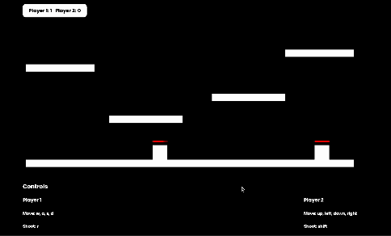

# Pixel Shooter

## Theme
Final Project for UCLA CS174A.

Our project is a 2D platformer inspired by the dynamics of classic arcade-style shooters, designed to be both challenging and engaging.

Pixel Shooter is a 2-player game set in a world where players navigate around platforms, dodge obstacles, and face adversaries. The goal will be to survive against the enemy trying to eliminate you as long as possible. Each player will have a certain amount of health. The player who loses all of their health first loses the game. The game will be played from a 2D side perspective. Each player will control a character who can move around the screen, jump, and shoot. The player will have to use their weapon to eliminate the other player.

## Demo



## Course Topics
The implementation of the game required matrix transformations, lighting, and texture materials. Player movement is a feature in this game. The movement of the players and projectiles all use matrix translations. As players move around, gravity is applied to their character as they jump around the level, dodging projectiles. Additional transformations like scaling are utilized to create each unique platform. Additionally, we use textures and lighting to give the game a vibrant 2D look.

An advanced feature that was implemented is collision detection. There is collision detection between projectiles and players, platforms and players, and projectiles and platforms. If a projectile intersects a player, they will lose health. Also, we will be using Physics-based simulations throughout the game to model projectile and player speeds.

## Interactivity
At the start of the game. A player is met with an intro screen where they can click a button to start the game. The DOM elements are then updated to show the hidden game.

Each player will have their own set of controls. Player 1 will use the "w", "a", "s", and "d" keys to move their character and "r" to shoot. Player 2 will use the up, left, down, and right arrows to control their character's movements and "shift" to attack. Each player will start with a fixed set of health at the start of each game. If a player loses all of their health, the game will end, and the winner will be announced with a game end screen.
Other interactivity features include. The player's health and the player's score. As the player takes damage, their health is updated accordingly. If a player wins, the score will be updated using the javascript DOM to add a point to that player's respective score.

## Advanced Topics
**Collision Detection:** We've implemented collision detection in the game. Characters will not fall through those objects when they interact with platforms or projectiles. If a projectile hits a character, they will lose health.

**Physics-based simulation:** Characters, health bars, and projectiles have a velocity, and the game implements gravity that affects the player and projectiles.

## Getting Started
Live demo:

```
https://awllms.com/pixelshooter
```
